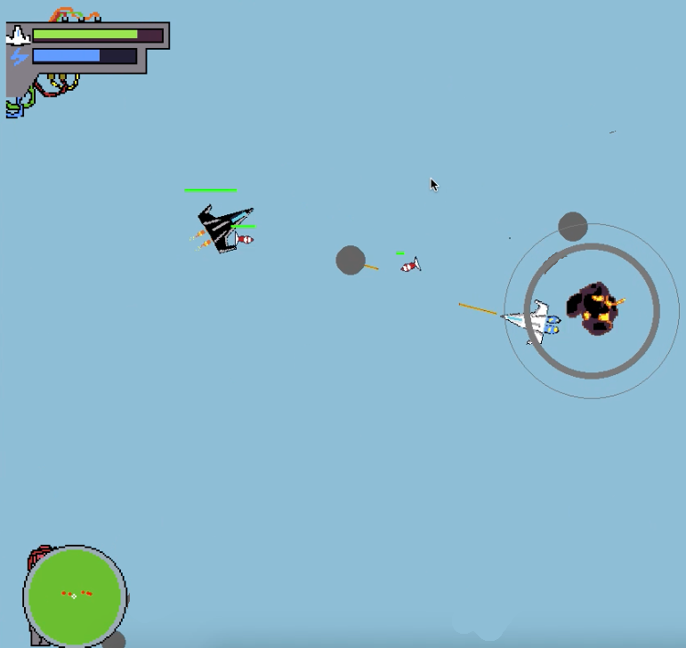

EscapeVector
============
Dogfight simulation game made in pygame. This is game is not for commercial usages, use it only for educational purposes.

Controls
----
1. w,a,d - for navigation
2. j - slowmotion
3. n - turbo acceleration
4. space - shooting

Dependancies
----------------
No external libraries used. One and only pygame.

Screenshot
-------

Demo Videos
-------
<a href="https://youtu.be/e01e3buBU4s">Demo Link</a>

Follow on:
--------
<a href="https://twitter.com/TEngineeringly">Twitter</a> 
<a href="https://www.youtube.com/channel/UCewPak9s7AnXupfVlYnbGtA?view_as=subscriber">Youtube</a>

In case of any errors, please create an issue.

